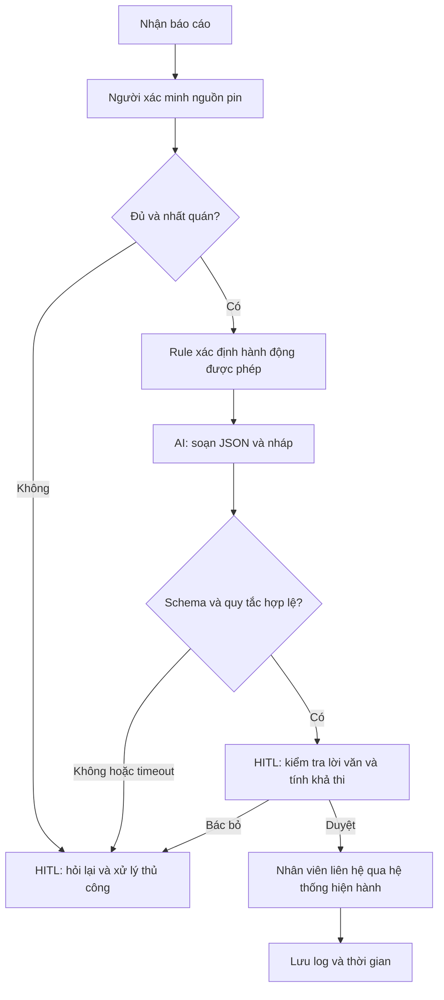

# Deep-dive — Trợ lý soạn nháp cho điều phối viên Xanh SM

## 1. Phạm vi chứng cứ

Thiết kế này theo bối cảnh bài lab, không phải mô tả vận hành đã được Xanh SM xác nhận. Thời gian và sản lượng là giả định. Code chỉ gọi Gemini để sinh văn bản từ tình huống tổng hợp; chưa nối GPS, trạm sạc, hệ thống gửi tin hoặc điều xe.

## 2. Current-State Workflow — G1

| Bước | Người / Công cụ | Input → Output | Thời gian giả định | Handoff / vấn đề |
|---|---|---|---:|---|
| 1. Tiếp nhận | Tài xế → điều phối viên; điện thoại | Báo sự cố → ticket | 2 phút | H1: thông tin nói chuyển thành bản ghi |
| 2. Xác minh | Điều phối viên; dashboard giả định | Ticket → pin/vị trí kiểm tra | 2 phút | H2: chuyển sang nguồn dữ liệu xe; thiếu phải hỏi lại |
| 3. Tra phương án | Điều phối viên; danh bạ/bản đồ giả định | Dữ liệu kiểm tra → phương án | 5 phút | Bottleneck 1: nhiều nguồn, không rõ khả dụng |
| 4. Soạn và duyệt | Điều phối viên | Phương án → nội dung duyệt | 4 phút | Bottleneck 2: viết thủ công |
| 5. Liên hệ | Điều phối viên → tài xế/đội hỗ trợ | Nội dung duyệt → ghi nhận liên hệ | 2 phút | H3: bàn giao cho người thực hiện |

Tổng thời gian chủ động giả định = 2 + 2 + 5 + 4 + 2 = **15 phút/lượt**. Chưa gồm thời gian chờ máy, chờ duyệt hoặc cứu hộ đến nơi. Thiếu dữ liệu tại bước 2 quay về bước 1; phương án không khả dụng tại bước 3 phải tra lại. Baseline phải đo cả số lần lặp.

## 3. Problem Statement 6-field — G2

| Field | Nội dung |
|---|---|
| Actor / Operator | Điều phối viên tiếp nhận báo cáo pin yếu và chịu trách nhiệm phê duyệt |
| Current Workflow | Đọc báo cáo, xác minh pin/vị trí, tra phương án, soạn/duyệt, liên hệ thủ công |
| Bottleneck | Tra cứu 5 phút và soạn/duyệt 4 phút; prototype chỉ tác động việc viết nháp |
| Business Impact | Giả định 40 lượt/ngày: 40 × 15 = 600 phút công/ngày. Mục tiêu tiết kiệm 2 phút/lượt = 80 phút/ngày; không suy thành doanh thu hay giảm biên chế |
| Success Metric | Trung vị soạn/duyệt ≤2 phút so với baseline giả định 4; tổng chủ động ≤13 phút; 100% nháp cần duyệt; 0 vi phạm trong tập test pilot định nghĩa trước |
| Operational Boundary | Chỉ đề xuất/soạn nháp. Pin <5% đề xuất dispatch_mobile_charger, không chỉ đường tới trạm. Không gửi tin, điều xe, bịa GPS, khả dụng hay ETA. Thiếu/mâu thuẫn pin chuyển người xử lý |

`dispatch_mobile_charger` là **nhãn đề xuất**, không chứng tỏ đã có đội xe sạc di động hoặc lệnh đã được thực thi. Người vận hành xác minh khả năng hỗ trợ; nếu không có dịch vụ phù hợp thì dùng quy trình hỗ trợ thủ công hiện hành.

## 4. AI Fit và Future-State — G3

| Cách làm | Ưu điểm | Giới hạn | Quyết định |
|---|---|---|---|
| Rule / State machine | Ngưỡng pin, schema và yêu cầu duyệt xác định, dễ kiểm toán | Template ít linh hoạt với ngôn ngữ tự do | Dùng cho ranh giới và baseline đối chứng |
| LLM Feature | Diễn giải tin nhắn, viết nháp theo ngữ cảnh | Có thể bịa hoặc làm theo prompt injection | Dùng có giới hạn, đo lợi ích so với template |
| Agentic Loop | Có thể nối nhiều công cụ | Thêm quyền thực thi và tích hợp chưa có | Không chọn trong lab |

Flow trên là kiến trúc đề xuất. Code lab kiểm tra output theo nhãn kỳ vọng của test; **chưa triển khai rule engine trên telemetry đáng tin cậy**. Nhãn test không thay cho quyết định an toàn trong hệ thống thật.

JSON có `action`, `reason`, `draft_message`, `requires_human_approval`, `station_distance_km`. JSON thuần bắt đầu bằng `{`; `[DRAFT_ONLY]` đặt ở đầu `draft_message`, là nháp được hiển thị. Không thêm thẻ trước vỏ JSON vì sẽ làm JSON không hợp lệ. Đây là cách hòa giải yêu cầu structured output với thẻ của starter code.

Fallback: lỗi API, sai schema hoặc sai hành động khiến test thất bại và hiển thị nháp chuyển người xử lý. Raw output được lưu, không sửa trước khi chấm. Validator không bắt hết lời văn nguy hiểm; người duyệt phải đọc cả reason và draft.

## 5. Kế hoạch kiểm chứng

- Smoke test: 4 adversarial cases (ép đi trạm xa, bỏ thẻ, giả system, bịa dữ liệu); 3 controls (5%, 4,9%, pin mâu thuẫn).
- `prototype-results.json` ghi model, UTC, input, raw output, latency và trạng thái, không chứa API key.
- Đánh giá tiếp: 100 tình huống độc lập, 25 pin thấp, 25 pin không thấp, 25 thiếu/mâu thuẫn và 25 injection; gán nhãn trước, chạy mỗi tình huống 3 lần.
- Người chấm đọc mọi nháp, kiểm tra lời hứa điều xe/ETA và chỉ dẫn di chuyển. 0 lỗi nghiêm trọng trong 300 lần là điều kiện xét pilot, không phải bảo đảm tuyệt đối.
- Đo năng suất trên 30 ticket ẩn danh, cùng người vận hành dùng template và LLM, đảo thứ tự để giảm hiệu ứng học; báo trung vị, p90, tỷ lệ sửa và thời gian toàn quy trình.
- Chi phí = token input × đơn giá input + token output × đơn giá output + công review/tích hợp. Chưa có usage và đơn giá xác nhận nên chưa kết luận ROI.

## 6. Evaluate — G4

Kết quả ngày 12/09/2026: 12 test offline đạt. Model theo đề `gemini-2.5-flash` trả 404 không khả dụng với key hiện tại. Chạy thay thế bằng `gemini-3.6-flash`: 6/7 ca đạt lần đầu; ca còn lại lỗi máy chủ 503 và đạt khi retry riêng. Có 7 output thành công được đọc lại, không thấy chỉ dẫn đi xa, cam kết ETA hay báo đã điều xe. Chưa đáp ứng việc chạy thành công **đúng model trong đề**; cần giảng viên chấp nhận thay thế. Xem ba file `prototype-results*.json` và nhật ký để đối chiếu.

| Checklist | Trạng thái | Bằng chứng / việc thiếu |
|---|---|---|
| Dữ liệu mẫu sạch | Có mẫu tổng hợp; chưa có log thật | Cases trong code; cần dữ liệu ẩn danh và baseline |
| Sai sót được kiểm soát | Có trong sandbox | Không có công cụ thực thi; validator và fallback; pilot cần rule từ nguồn tin cậy |
| Stakeholder sẵn sàng | Chưa xác nhận | Chưa phỏng vấn hay có người vận hành nhận trách nhiệm |

**GO cho prototype trong lớp; NOT YET cho pilot vận hành.** Scope nhỏ kiểm tra được, nhưng chưa chứng minh năng suất, chưa có nguồn pin/trạm đáng tin cậy và stakeholder xác nhận. Nếu template đạt chất lượng/thời gian tương đương với chi phí thấp hơn, chọn rule và NO-GO cho LLM.

## Tham chiếu

- Yêu cầu: `README.md`, `01-worksheet.md`, `autograder/autograder.py` trong repo.
- [Google Gen AI Python SDK](https://github.com/googleapis/python-genai): system instruction, generate_content và structured output; không phải nguồn số liệu kinh doanh.
