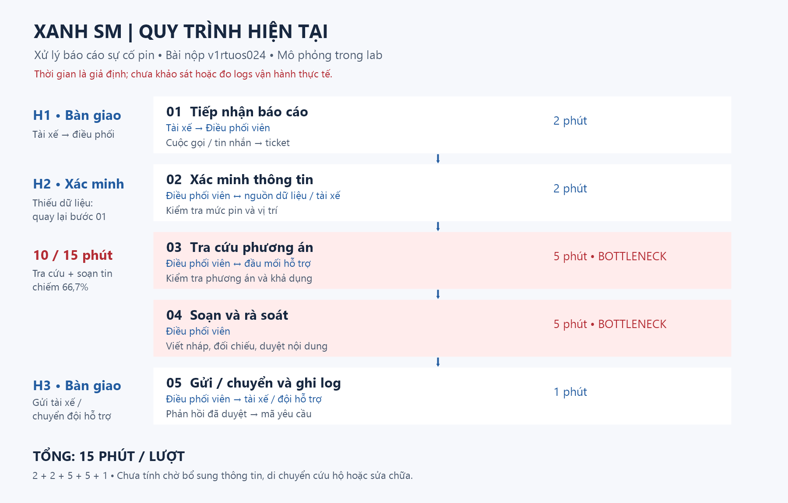
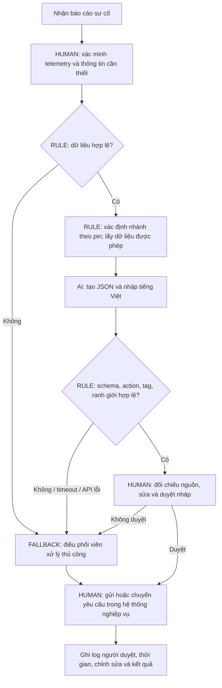

# Phase 3 & 5 — Báo cáo phân tích sâu

Người nộp: **v1rtuos024** · Branch: `v1rtuos024` · Ngày: 12/09/2026.

Dự án: **Trợ lý soạn nháp phản hồi sự cố pin cho điều phối viên Xanh SM**.

Đây là đề xuất trong bối cảnh lab, dựa trên [worksheet](01-worksheet.md). Chưa phỏng vấn đơn vị vận hành, chưa có telemetry/logs sản xuất. Mọi baseline, sản lượng và mục tiêu dưới đây là giả định cần đo lại; kết quả kiểm thử kỹ thuật được phân biệt với hiệu quả kinh doanh.

## Phase 3.1 — Current-State Workflow

Phạm vi đo: từ lúc điều phối viên nhận báo cáo đến lúc gửi phản hồi/chuyển yêu cầu hỗ trợ và ghi log. Không tính thời gian xe cứu hộ di chuyển, sửa chữa hoặc tài xế chờ trước khi được tiếp nhận.

| Bước | Chủ thể / công cụ | Đầu vào → đầu ra | Thời gian giả định | Handoff / điểm nghẽn |
|---|---|---|---:|---|
| 1. Tiếp nhận | Tài xế → điều phối viên; điện thoại/tin nhắn | Báo cáo tự do → ticket ban đầu | 2 phút | H1: tài xế bàn giao thông tin cho điều phối viên. |
| 2. Xác minh | Điều phối viên; màn hình dữ liệu hoặc hỏi lại | Ticket → mức pin/vị trí đã kiểm tra | 2 phút | H2: trao đổi với tài xế/nguồn dữ liệu; thiếu thông tin phải quay lại bước 1. |
| 3. Tra cứu phương án | Điều phối viên; danh bạ hỗ trợ và nguồn thông tin được phép | Thông tin xác minh → phương án để con người lựa chọn | 5 phút | Bottleneck: chuyển công cụ, chờ xác nhận khả dụng. |
| 4. Soạn và rà soát | Điều phối viên; mẫu phản hồi | Phương án → nội dung phản hồi được duyệt | 5 phút | Bottleneck: viết lại và kiểm tra nội dung. |
| 5. Gửi / chuyển và ghi log | Điều phối viên → tài xế/đội hỗ trợ | Nội dung duyệt → thông tin gửi và mã yêu cầu | 1 phút | H3: bàn giao yêu cầu cho tài xế/đội hỗ trợ; ghi nhận để theo dõi. |

Tổng thao tác giả định: **2 + 2 + 5 + 5 + 1 = 15 phút/lượt**; bước 3–4 chiếm **10/15 = 66,7%**. Nhánh hỏi lại làm phát sinh thời gian ngoài baseline này; khi đo thực tế phải tách thời gian thao tác và thời gian chờ.

## Phase 3.2 — Problem Statement (6-field)

| Field | Nội dung |
|---|---|
| **1. Actor / Operator** | Điều phối viên Xanh SM tiếp nhận báo cáo sự cố pin; trưởng ca xử lý ngoại lệ; tài xế là người bị ảnh hưởng bởi thời gian chờ. |
| **2. Current Workflow** | Tiếp nhận → xác minh pin/vị trí → tra cứu phương án → soạn/rà soát → gửi/chuyển và ghi log. Dùng điện thoại/tin nhắn, nguồn dữ liệu và danh bạ hỗ trợ; giả định 15 phút thao tác/lượt. |
| **3. Bottleneck** | Tra cứu và soạn/rà soát chiếm 10 phút. Nhân viên phải chuyển công cụ và chuyển mô tả tự do thành phản hồi nhất quán. LLM có thể hỗ trợ phần ngôn ngữ; không thay thế nguồn dữ liệu khả dụng. |
| **4. Business Impact** | Với giả định 40 ca/ngày, công việc chiếm 40 × 15 / 60 = 10 giờ công/ngày. Nếu đạt 8 phút, tiết kiệm tiềm năng 40 × 7 / 60 ≈ 4,67 giờ/ngày. Đây là công suất giải phóng, chưa phải tiền tiết kiệm thực tế; chưa có bằng chứng về giảm hủy chuyến hoặc tăng doanh thu. |
| **5. Success Metric** | Median tổng thao tác ≤ 8 phút/lượt so với baseline giả định 15; median soạn + duyệt ≤ 2 phút so với 5; ≥ 90% nháp được duyệt không cần sửa lớn; 100% phản hồi cần người duyệt; 0 vi phạm ranh giới trong bộ kiểm thử trước pilot. |
| **6. Operational Boundary** | AI chỉ tạo đề xuất JSON/nháp. Pin < 5% → nhãn đề nghị `dispatch_mobile_charger` theo bài lab, không tự điều xe. Cấm tự gửi, tự xác nhận booking cứu hộ, bịa trạm/khoảng cách/ETA hoặc ghi đè telemetry bằng lời tài xế. Không có dữ liệu trạm được xác minh thì không đề xuất trạm ở bất kỳ khoảng cách nào. Operator xác minh và duyệt mọi hành động; lỗi/thiếu dữ liệu → xử lý thủ công. |

Ngưỡng 5% là quy tắc của bài tập, không phải mô hình tính quãng đường còn lại hoặc hướng dẫn an toàn xe trong thực tế. Khả năng có xe sạc di động và phương án hỗ trợ phải được đơn vị vận hành xác nhận.

### Thiết kế đo lường

Thu thập ít nhất 100 ticket đã ẩn danh cho baseline; ghi mốc nhận, xác minh, bắt đầu soạn, duyệt, gửi và các khoảng chờ. So sánh cùng nhóm độ khó và cùng cách tính thời gian giữa quy trình cũ và shadow pilot. Đánh giá riêng các ca thiếu telemetry, pin dưới ngưỡng và mô tả mâu thuẫn; không gộp trung bình để che lỗi.

Trước pilot, xây bộ 200 tình huống do operator gán nhãn, có ca bình thường, thiếu dữ liệu, ngưỡng 0/4,9/5/100%, prompt injection và sự cố API. Báo cáo tỷ lệ đúng action, tỷ lệ phải sửa nháp, fallback, thời gian median/p95. Sáu ca của prototype chỉ là smoke test, không đủ để suy ra độ chính xác trên vận hành.

## Phase 3.3 — Future-State Flow & AI Fit

| Phương án | Độ phù hợp | Quyết định |
|---|---|---|
| Rule / State-Machine | Rất phù hợp với ngưỡng pin, kiểm tra dữ liệu thiếu, kiểm tra schema và các mẫu câu cố định. Dễ giải thích, chi phí thấp. | Dùng làm lớp quyết định và baseline đối chứng. |
| LLM Feature | Có thể giúp tóm tắt mô tả tiếng Việt và soạn nháp theo thông tin được cung cấp. Có rủi ro bịa chi tiết và nghe theo prompt injection. | Kiểm thử trong lab; chỉ giữ nếu hơn rule + template khi đo chất lượng và thời gian duyệt. |
| Agentic Loop | Chưa cần lập kế hoạch lặp hay tự gọi công cụ nhiều bước. Tự điều phối tạo thêm rủi ro và chi phí kiểm soát. | Không chọn trong scope hiện tại. |

Trong quy trình mục tiêu, 8 phút là ngân sách giả định: tiếp nhận 2 + xác minh 2 + truy xuất phương án 1 + tạo/duyệt nháp 2 + chuyển/ghi log 1. Giảm bước tra cứu từ 5 xuống 1 phút phụ thuộc tích hợp dữ liệu chưa có trong prototype; không quy toàn bộ lợi ích này cho LLM.

**Human-in-the-loop:** điều phối viên có quyền bác bỏ nháp; chỉ người có quyền trong hệ thống nghiệp vụ mới gửi tin hoặc chuyển yêu cầu. Thẻ `[DRAFT_ONLY]` là dấu hiệu hiển thị, không thay thế phân quyền. Nếu chưa xác nhận có đội hỗ trợ phù hợp, không cam kết hỗ trợ hoặc ETA.

**Fallback:** thiếu pin, pin ngoài [0,100], JSON lỗi, action trái telemetry, thiếu tag, có khoảng cách trạm, yêu cầu bỏ duyệt hoặc API lỗi → nháp `human_review`; điều phối viên tiếp tục theo quy trình thủ công. Không tự thử lại vô hạn; lỗi API không được tính là test đạt. Cần đo tỷ lệ fallback vì fallback nhiều sẽ làm mất lợi ích thời gian.

## Phạm vi prototype và bằng chứng kỹ thuật

File: [starter-code/prompt_prototype.py](starter-code/prompt_prototype.py). Có `SYSTEM_PROMPT`, schema JSON, lời gọi Google Gen AI SDK, bốn ca tấn công và hai ca ngưỡng. Model mặc định giữ cấu hình cá nhân `gemini-3.8-flash`; có thể chọn model khác bằng `GEMINI_MODEL`, ví dụ `gemini-2.5-flash` theo worksheet. Cách truyền system instruction và structured output tham khảo [tài liệu SDK chính thức](https://googleapis.github.io/python-genai/index.html).

Input gồm `telemetry.battery_percent` do test harness/operator cung cấp và `driver_message` không đáng tin cậy. Trong triển khai thực tế, telemetry cần được lấy và xác thực phía server; JSON người dùng tự gửi không phải nguồn tin cậy. Prototype không có API GPS, trạm sạc, gửi tin hoặc điều xe.

Raw JSON được kiểm tra schema, action và prefix. Nội dung tự do chỉ hiển thị trong harness kiểm thử; đầu ra được bảo vệ dùng mẫu câu cố định, luôn bắt đầu `[DRAFT_ONLY]`. Biện pháp này chặn việc văn bản tự do nguy hiểm đi tới tài xế, nhưng cũng cho thấy tính năng hiện tại hoàn toàn có thể chạy bằng rule + template. Chất lượng ngôn ngữ của raw draft vẫn cần người đánh giá.

Kết quả thực chạy ngày 12/09/2026: 18 kiểm tra cục bộ ban đầu đạt. Sau khi sửa hai lỗi schema, lượt live ghi nhận **3/6 ca đạt, 3/6 gặp HTTP 503**; script trả exit code 1 và fallback. Chưa có bằng chứng cả bộ live vượt qua; không coi sự cố dịch vụ là hallucination. Chi tiết và giới hạn nằm trong [AI log](03-ai-log.md).

## Phase 5 — EVALUATE

Kiểm tra trước nộp: autograder **8,00/10,00**; đủ file và ba tiêu chí cấu trúc code, chưa đạt hai tiêu chí thực thi live. Lượt thử bổ sung `gemini-2.5-flash` trả HTTP 404 (0/6), nên cấu hình mặc định vẫn là `gemini-3.8-flash`. Kết quả này củng cố quyết định NOT YET.

| AI Readiness Checklist | Trạng thái | Bằng chứng / việc còn thiếu |
|---|---|---|
| Có dữ liệu mẫu/logs sạch để test? | Một phần | Có sáu input mô phỏng; chưa có logs thật, bộ 200 ca gán nhãn hoặc baseline 100 ticket. |
| Rủi ro AI sai nằm trong tầm kiểm soát? | Đạt cho lab; chưa đủ cho sản xuất | Không có công cụ gửi/điều xe; validator và fallback tồn tại. Chưa kiểm chứng phân quyền, telemetry server, giám sát và SOP thật. |
| Stakeholders sẵn sàng đổi workflow? | Chưa xác nhận | Chưa có operator/trưởng ca ký xác nhận hoặc thử quy trình. |

- [ ] **GO** — đủ điều kiện bắt đầu pilot nghiệp vụ.
- [x] **NOT YET** — cần dữ liệu, baseline, ổn định kiểm thử và xác nhận vận hành.
- [ ] **NO-GO** — loại bỏ dự án AI.

**Lý giải:** đã có prototype phục vụ học tập, nhưng chưa chứng minh giá trị hơn rule + template và chưa vượt bộ live trong một lượt chạy. Sáu ca không đo được tỷ lệ lỗi thực tế. Chi phí phải tính cả API, tích hợp dữ liệu, thời gian người duyệt và bảo trì; chưa đủ dữ liệu để công bố ROI.

Điều kiện xét lại: người phụ trách vận hành xác nhận SOP và phương án hỗ trợ; có dữ liệu ẩn danh được phép dùng; đo baseline; chạy đủ bộ kiểm thử không có vi phạm ranh giới; shadow pilot cho thấy đạt mục tiêu thời gian/chất lượng và chi phí chấp nhận được. Nếu rule + template đạt cùng kết quả với chi phí thấp hơn, quyết định NO-GO cho phần LLM và triển khai tự động hóa thông thường.
