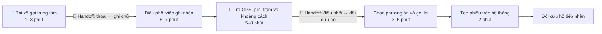
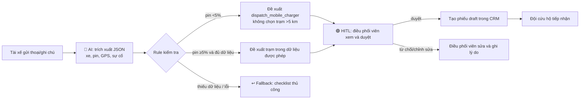

# 02 — Deep-Dive Report: Xanh SM Incident Dispatch Copilot

## Phạm vi

Đề xuất một trợ lý cho điều phối viên xử lý sự cố pin EV trên đường. Prototype chỉ tạo bản nháp và phiếu đề xuất; hệ thống vận hành hiện tại vẫn là nơi quyết định và gửi lệnh.

## 3.1 Current-State Workflow Mapping

**Tổng thời gian trung bình:** khoảng 18 phút/lượt (P50 giả định; P90 có thể 30 phút trong giờ cao điểm).

**Bottleneck:** bước tra cứu và suy luận phương án (5–8 phút), vì dữ liệu nằm ở cuộc gọi, GPS, trạng thái pin và bản đồ; điều phối viên phải chuyển đổi giữa nhiều màn hình. Nếu pin dưới 5%, chọn nhầm trạm xa có thể làm xe dừng giữa đường.

## 3.2 Problem Statement (6-field)

| Field | Nội dung |
|---|---|
| **1. Actor / Operator** | Điều phối viên trung tâm Xanh SM; tài xế gửi thông tin qua điện thoại/app; đội cứu hộ nhận phiếu. |
| **2. Current Workflow** | Nhận cuộc gọi, hỏi lại biển số/vị trí/pin, ghi chú tự do, tra bản đồ và trạm, gọi đội cứu hộ, nhập phiếu. Công cụ: điện thoại, CRM, bản đồ và bảng trạng thái trạm. |
| **3. Bottleneck** | Trích xuất dữ liệu từ lời nói và tra cứu chéo thủ công. Dữ liệu thiếu dẫn tới gọi lại; giờ cao điểm tạo hàng đợi. |
| **4. Business Impact** | 18 phút/lượt làm tăng thời gian chờ và nguy cơ hủy chuyến; ước tính 400 sự cố/tháng × 13 phút có thể tiết kiệm ≈87 giờ điều phối/tháng. Sai hướng dẫn khi pin thấp có rủi ro an toàn và chi phí cứu hộ tăng. |
| **5. Success Metric** | P50 tạo phiếu ≤5 phút; ≥95% phiếu đủ 5 trường (xe, vị trí, pin, mức khẩn cấp, phương án); ≥90% phân loại đúng trong tập kiểm thử; 0 đề xuất trạm >5 km khi pin <5%; ≥85% bản nháp được duyệt nguyên trạng. |
| **6. Operational Boundary** | Được phép trích xuất, tóm tắt, tính khoảng cách từ dữ liệu đã cung cấp và soạn draft. Không được tự gửi tin/gọi/điều xe, bịa vị trí hoặc tình trạng trạm, đưa trạm >5 km khi pin <5%, hay bỏ qua cảnh báo. Mọi phiếu cần điều phối viên duyệt; thiếu dữ liệu hoặc confidence <0,8 thì fallback về quy trình thủ công. |

## 3.3 Future-State Flow & AI Fit

**AI-Fit Matrix:** Rule/State Machine cho ngưỡng pin và quyền gửi; LLM feature cho trích xuất/tóm tắt; chưa dùng Agentic Loop trong MVP vì hành động điều xe có tác động thực địa.

LLM nhận đầu vào đã được giảm thiểu dữ liệu, trả JSON theo schema và confidence. Rule engine chạy sau LLM để khóa các hành vi nguy hiểm; LLM không có quyền gọi công cụ bên ngoài. Điều phối viên là Human-in-the-loop, chịu trách nhiệm xác nhận vị trí, khoảng cách và phương án trước khi CRM phát hành phiếu. Khi API lỗi, JSON không hợp lệ, thiếu trường hoặc confidence thấp, hệ thống hiển thị checklist và dùng kịch bản cứu hộ hiện tại.

## 3.4 Evaluation và AI Readiness

| Checklist | Đánh giá | Bằng chứng / việc cần làm |
|---|---|---|
| Có dữ liệu mẫu/log sạch để test? | **Một phần** | Có thể lấy 200 ticket đã ẩn danh; cần gắn nhãn pin, GPS, phương án và split theo thời gian. |
| Rủi ro AI sai có kiểm soát? | **Có điều kiện** | Rule pin <5%, giới hạn khoảng cách, schema và HITL; kiểm thử red-team trước pilot. |
| Stakeholder sẵn sàng đổi quy trình? | **Có điều kiện** | Điều phối viên tham gia thiết kế checklist; pilot một ca và đo acceptance trước khi mở rộng. |

### Quyết định: **NOT YET**

Chưa phát hành prototype vào vận hành ngay vì baseline dữ liệu và độ chính xác định tuyến chưa được đo trên log thật. Nhóm nên dành một sprint để ẩn danh/gắn nhãn 200–500 ticket, chạy offline evaluation và xác nhận danh sách trạm chuẩn. Sau khi đạt ≥90% route đúng, 0 lỗi critical-battery trong test và phê duyệt SOP của vận hành, chuyển sang pilot có giám sát. Chi phí LLM có thể thấp hơn thời gian điều phối tiết kiệm, nhưng chỉ hợp lý khi mọi hành động bên ngoài vẫn qua HITL.
